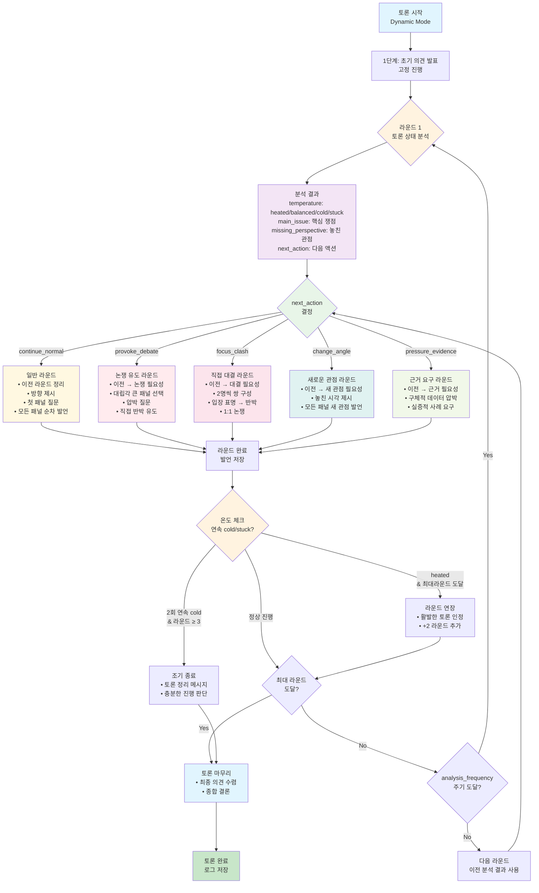

# 🎭 Dynamic 토론 시스템 가이드

## 📋 개요

**Dynamic 토론**은 AI가 실시간으로 토론 상태를 분석하여 진행 방식을 적응적으로 조정하는 지능형 토론 시스템입니다. 기존의 정적인 순차 진행 방식에서 벗어나, 토론의 온도와 흐름에 따라 다양한 개입 방식을 사용합니다.

## 🔄 토론 흐름도



## 📊 토론 상태 분석 시스템

Dynamic 토론의 핵심은 **실시간 토론 상태 분석**입니다. AI가 매 라운드마다 다음 요소들을 분석합니다:

| 분석 요소 | 가능한 값 | 의미 |
|-----------|-----------|------|
| **temperature** | `heated`, `balanced`, `cold`, `stuck` | 토론의 열기와 활발함 정도 |
| **main_issue** | 자유 텍스트 | 현재 가장 핵심적인 논쟁거리 |
| **missing_perspective** | 자유 텍스트 | 아직 다뤄지지 않은 중요한 관점 |
| **next_action** | 5가지 액션 중 선택 | AI가 권장하는 다음 진행 방식 |
| **intervention** | 자유 텍스트 | 구체적인 개입 방안 |

### 🌡️ Temperature 가이드

- **🔥 heated**: 격렬한 논쟁, 활발한 반박, 강한 대립
- **⚖️ balanced**: 균형잡힌 토론, 적절한 논쟁 수준
- **❄️ cold**: 식어가는 토론, 반복적 주장, 새로운 내용 부족
- **🔒 stuck**: 교착 상태, 동일한 논점 반복, 진전 없음

## 🎯 5가지 라운드 타입

### 1. 📝 **일반 라운드** (`continue_normal`)

**구조**: 이전 정리 → 방향 제시 → 순차 발언

**특징**: 
- 균형잡힌 토론 진행
- 모든 패널에게 동등한 발언 기회
- 자연스러운 토론 흐름 유지

**사용 시기**: 토론이 정상적으로 흘러갈 때

**예시**:
```
[토론 진행자] 앞서 각 패널께서 기본 입장을 밝혀주셨습니다. 
이제 좀 더 구체적인 근거와 사례를 통해 논의를 심화해보겠습니다. 
김철수 패널께서는 방금 언급하신 생물학적 차이에 대한 
구체적인 연구 사례를 제시해주실 수 있나요?
```

### 2. ⚔️ **논쟁 유도 라운드** (`provoke_debate`)

**구조**: 이전 정리 → 논쟁 필요성 → 압박 질문

**특징**:
- 대립각이 큰 패널 2명 집중
- 직접적인 반박과 재반박 유도
- 압박 질문을 통한 논쟁 심화

**사용 시기**: 토론이 식어갈 때, 더 치열한 논쟁이 필요할 때

**예시**:
```
[토론 진행자] 지금까지의 논의에서 중요한 쟁점이 부각되고 있습니다. 
이제 좀 더 직접적인 논쟁이 필요해 보입니다. 
김철수 패널께서는 박미영 패널의 교육 평등론에 대해 
어떻게 반박하시겠습니까?
```

### 3. 🥊 **직접 대결 라운드** (`focus_clash`)

**구조**: 이전 정리 → 대결 필요성 → 1:1 대결

**특징**:
- 패널을 쌍으로 나누어 직접 논쟁
- 입장 표명 → 반박 → 재반박 구조
- 명확한 대립각 형성

**사용 시기**: 명확한 대립각 형성이 필요할 때

**예시**:
```
[토론 진행자] 이제 핵심 쟁점에 대해 직접적인 토론이 필요해 보입니다. 
김철수 패널과 박미영 패널께서 교육 방식에 대해 
직접 토론해주시기 바랍니다. 김철수 패널께서 먼저 입장을 
밝혀주시고, 박미영 패널께서 반박해주시기 바랍니다.
```

### 4. 🔄 **새로운 관점 라운드** (`change_angle`)

**구조**: 이전 정리 → 새 관점 필요성 → 시각 전환

**특징**:
- 놓친 관점이나 새로운 시각 도입
- 경제적, 사회적, 문화적 등 다양한 관점
- 토론의 시각을 확장

**사용 시기**: 토론이 한쪽으로 치우치거나 교착상태일 때

**예시**:
```
[토론 진행자] 지금까지 교육학적 관점에서 논의해왔습니다. 
이제 경제적 측면에서는 어떨지 살펴보겠습니다. 
김철수 패널께서는 성별 분리 교육의 경제적 효율성에 대해 
어떻게 보십니까?
```

### 5. 📋 **근거 요구 라운드** (`pressure_evidence`)

**구조**: 이전 정리 → 근거 필요성 → 데이터 압박

**특징**:
- 구체적 사례, 통계, 연구 결과 요구
- 주장의 신뢰성 검증
- 실증적 근거 기반 논의

**사용 시기**: 주장만 있고 근거가 부족할 때

**예시**:
```
[토론 진행자] 지금까지 다양한 주장들이 제기되었습니다. 
이제 구체적인 근거와 데이터로 논의를 뒷받침해보겠습니다. 
김철수 패널께서는 방금 주장에 대한 구체적인 
연구 데이터나 통계를 제시해주실 수 있나요?
```

## ⚡ 적응적 시간 관리

### 🔚 조기 종료 조건

**조건**:
- 연속 2라운드 `cold` 또는 `stuck` 상태
- 최소 3라운드 이상 진행 완료

**동작**:
```
[토론 진행자] 지금까지 충분히 깊이 있는 논의가 진행되었습니다. 
각 패널의 입장이 명확해졌으므로 이제 토론을 정리하겠습니다.
```

### ⏰ 연장 조건

**조건**:
- `temperature: heated` 상태
- 최대 라운드 도달 시점

**동작**:
- +2 라운드 추가
```
[토론 진행자] 토론이 매우 활발하고 생산적으로 진행되고 있습니다. 
조금 더 시간을 가져 심도 있는 논의를 계속하겠습니다.
```

## 🔄 자연스러운 라운드 전환

### ❌ 기존 (Static) 방식
```
--- 토론 라운드 2 ---
[토론 진행자] 라운드 2를 시작하겠습니다.
[토론 진행자] 김철수 패널 의견을 말씀해주세요.
```
**문제점**: 사회자 2회 연속 발언, 맥락 없는 전환

### ✅ 개선된 (Dynamic) 방식
```
--- 토론 라운드 2 ---
[토론 진행자] 앞서 각 패널께서 기본 입장을 밝혀주셨습니다. 
이제 구체적인 근거와 실례를 통해 논의를 심화해보겠습니다. 
김철수 패널께서는 달러 약화가 미국 내 실물경제에 미치는 
구체적 영향에 대해 말씀해주실 수 있나요?

(김철수 응답)

[토론 진행자] 박미영 패널께서도 이어서 의견을 말씀해 주시기 바랍니다.
```
**개선점**: 
- 통합된 라운드 시작 (정리 → 방향 → 질문)
- 자연스러운 패널 전환
- 맥락이 있는 질문

## ⚙️ 설정 및 사용법

### 📝 설정 파일 (config.yaml)

```yaml
debate:
  mode: "dynamic"  # "static" or "dynamic"
  duration_minutes: 10
  max_turns_per_agent: 3
  panel_size: 4
  show_debug_info: false
  
  # Dynamic 모드 세부 설정
  dynamic_settings:
    max_rounds: 6              # 최대 라운드 수
    analysis_frequency: 2      # 몇 라운드마다 토론 상태 분석할지
    intervention_threshold: "balanced"  # 개입 임계점
```

### 🎛️ 설정 파라미터 설명

| 파라미터 | 기본값 | 설명 |
|----------|--------|------|
| `max_rounds` | 6 | 최대 진행 가능한 라운드 수 |
| `analysis_frequency` | 2 | 몇 라운드마다 AI 분석을 수행할지 |
| `intervention_threshold` | "balanced" | 언제부터 적극적 개입을 시작할지 |

### 🚀 사용법

1. **Dynamic 모드 활성화**:
   ```yaml
   debate:
     mode: "dynamic"
   ```

2. **토론 실행**:
   ```bash
   python main.py
   ```

3. **토론 주제 입력**:
   - 시스템이 자동으로 패널 구성
   - Dynamic 분석을 통한 적응적 진행

## 📈 Static vs Dynamic 비교

| 측면 | Static 토론 | Dynamic 토론 |
|------|-------------|--------------|
| **진행 방식** | 고정된 순서 | 상황별 적응 |
| **매니저 역할** | 단순 발언권 분배 | 지능적 개입 |
| **시간 관리** | 고정된 라운드 | 유동적 조정 |
| **토론 품질** | 예측 가능 | 역동적, 흥미진진 |
| **사용자 경험** | 정형화된 느낌 | 자연스러운 토론 |

## 🎯 장점

### 🧠 **지능적 진행**
- AI가 토론 상태를 실시간 분석
- 상황에 맞는 최적의 진행 방식 선택
- 토론의 질과 흥미도 극대화

### 🌊 **자연스러운 흐름**
- 맥락이 있는 라운드 전환
- 구체적인 패널 이름 사용
- 반복적 표현 방지

### ⚡ **적응적 시간 관리**
- 지루한 토론은 조기 종료
- 활발한 토론은 연장
- 효율적인 시간 사용

### 🎭 **다양한 진행 방식**
- 5가지 라운드 타입으로 변화무쌍
- 논쟁 유도, 직접 대결, 새 관점 등
- 예측 불가능한 흥미로운 전개

## 🔮 향후 개선 계획

- **패널 성향 분석**: 각 패널의 논쟁 스타일 학습
- **주제별 최적화**: 주제 유형에 따른 진행 방식 특화
- **사용자 피드백**: 토론 품질에 대한 실시간 피드백 반영
- **고급 분석**: 감정 분석, 논리 구조 분석 등 추가

---

**Dynamic 토론 시스템**으로 정적이고 예측 가능한 토론에서 **역동적이고 지능적인 토론**으로 완전히 진화했습니다! 🚀✨